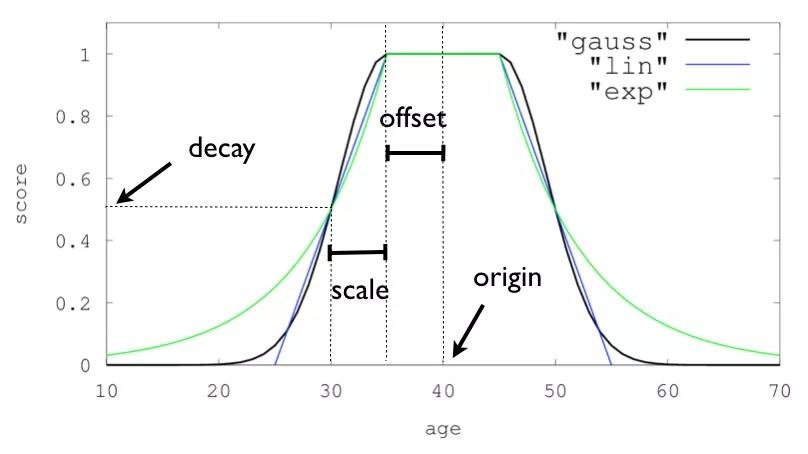

# ElasticSearch学习记录
## 数据类型
### 基础类型
#### 字符串
- ~~String~~ : 高版本的ES已经停用
- text : 当一个字段是要被全文搜索的使用text类型。设置text类型以后，字段内容会被分析，在生成倒排索引，字符串会被分析器分成一个一个词项。**text类型的字段不用于排序，很少用于聚合。**
- keyword : 适用于索引结构化的字段。如果字段需要进行过滤、排序、聚合需要采用keyword字段。**keyword类型的字段只能通过精确值搜索到。**

#### 日期

date类型，**需要注意**：

1. Elasticsearch采用UTC时区，与北京时间相差8小时，同步时需要注明时区。
2. 默认格式是 strict_date_optional_time||epoch_millis 只接受年月日必须是4位、2位、2位表示，不足两位用0补齐的字符串日期或者long型数字的毫秒时间戳。
3. 可以指定format使得取时间时是按照固定格式。

#### 整数

**在满足需求的情况下，尽可能选择范围小的数据类型。**

| 类型    |   取值范围   |
| ------- | :----------: |
| byte    |   -128~127   |
| short   | -32768~32767 |
| integer |  -231~231-1  |
| long    |  -263~263-1  |

### 高级类型

#### 数组

可以支持字符数组，整数数组，对象数组。**不支持元素为多个数据类型！**

#### 对象

JSON对象，包含嵌套的对象。

#### 嵌套

Nested类型允许独立的索引每一个对象，对性能的影响较大。


## Ik分词 与 pinyin分词

- [x] 导入字典
- [ ] 导入研究人员名称
- [ ] 导入停用词
- [ ] 自动化更新字典


## 算法（BM25）优化

用$D$代指计算文档，$Q$指的是用户输入的搜索关键词，将$Q$分词后得到若干词$q_i$，计算得到的分数为$score(D,Q)$如下。
$$
score(D,Q) = \sum_{i=1}^n IDF(q_i) \cdot \frac{f(q_i,D)\cdot(k_1+1)}{f(q_i,D)+k_1 \cdot (1-b+b\cdot \frac{\left\vert D\right\vert}{avgdl})}
$$

在公式中有两个常数参数$b$和$k_1$。其中参数$b$的作用是调整文档长度对相关性影响的大小。$b$越大，文档长度的对相关性得分的影响越大，反之越小。参数$k_1$的作用是调节$q_i$增加时，得分增加的幅度。经过实践验证，通常的系统中选择$b = 0.75,k=2$可以获得较好的效果。

## Query DSL

### 1. 采用multi_match匹配

最简单的匹配方式，获得的结果难以满足要求。

```json
{
    "query":{
        "multi_match":{
            "query": "search_text",
            "fields":[
                "f1","f2"
            ]
        }
    }
}
```
### 2. 采用bool查询

添加筛选的查询方式。提供must，should，must_not，filter四种方式组合。

- must必须满足，非直接过滤，参与评分。
- should在有must的情况下无需满足，无must的情况下必须满足至少一个。默认参与评分，可以选择最少满足个数与是否参与评分。
- must_not与filter为过滤器，不参与评分。

```json
{
    "query":{
        "bool":{
            "should":[
                {"match":{"f1":"search_text"}},
                {"match":{"f2":"search_text"}}
            ],
            "filter":[
                {"range":{"date":{"gte":"2010-01-01"}}},
            ]
        }
    }
}
```


### 3. 采用match_phrase提高权重

解决搜索经常出现**搜索结果和搜索关键词不是连续匹配的**这个问题。match_phrase 要求必须命中所有分词，并且返回的文档命中的词也要按照查询短语的顺序，**词的间距可以使用 slop 设置**。同时使用 match 与 match_phrase 查询语句，这样相当于 match_pharse 提高了搜索短语顺序的权重，使得能够顺序匹配到的文档相关性评分更高。设置索引mappings时，**给 tags 字段设置上 position_increment_gap （默认100），来增加数组元素之间的位置，此位置要超过查询所使用的 slop**。


```json
{
    "query":{
        "bool":{
            "should":[
                {"match":{"f1":"search_text"}},
                {"match_phrase":{"f1":{"query":"search_text","slop":5}}},
                {"match":{"f2":"search_text"}}
            ],
            "filter":[
                {"range":{"date":{"gte":"2010-01-01"}}},
            ]
        }
    }
}
```


### 4. 采用boost调整查询语句的权重

**查询时可以用 boost 配置来增加权重**。设置后，查询语句的得分等于**默认得分乘以 boost**。

- 数据质量高的字段可以相应提高权重；

- match_phrase 语句的权重应该高于相应字段 match 查询的权重，因为文档中按顺序匹配的短语可能数量不会太多，但是查询关键词被分词后的词语将会很多，match的得分将会比较高，则 match 的得分将会冲淡 match_phrase 的影响；

- 在 mappings 设置中，可以针对字段设置权重，查询时不用再针对字段使用 boost 设置。


```json
{
    "query":{
        "bool":{
            "should":[
                {"match":{"f1":"search_text"}},
                {"match_phrase":{"f1":{"query":"search_text","slop":5,"boost":10}}},
                {"match":{"f2":"search_text"}}
            ],
            "filter":[
                {"range":{"date":{"gte":"2010-01-01"}}},
            ]
        }
    }
}
```


### 5.采用function_score增加评分因素

为了增加实际项目中时间，对文档评分的影响往往比较复杂，不仅仅时简单的计算相关度，还需要根据字段对评分进行一定的计算。function_score可以解决以下问题。

- **时间影响**：距今越近的文档具有更高的评分；
- **收藏影响**：收藏数量更多的文档具有更高的评分；
- **完整性影响**：完整的文档比残缺的文档具有更高的评分；
- **推广影响**：被推广的文档具有更高的评分；
- ······

在数据搭建阶段我们就能确定这些因素的权重，并且和查询关键词没有什么关系。称之为静态评分，一般具有以下特点：

- **稳定性**：不要经常有大幅度的变动，如果大幅度变化会导致用户搜索相同的关键词过段时间出来的结果会不同；
- **连续性**：相似静态评分的情况下，文档的相关的等其他因素可以充分发挥作用。
- **区分度**：在连续稳定的情况下，应该有一定的区分度，也即分值的间隔应该合理。如果有 1000 份文档，在 1.0 分到 1.001 分之间，这其实是没有实际意义的，因为对文档排名的影响太少了。 

在ES中有以下的方式实现这些因素对排名的影响：

- script_score，这是最灵活的方式，可以自定义算法；
- weight，乘以一个权重数值；
- random_score，随机分数；
- field_value_factor，使用某个字段来影响总分数；
- decay fucntion，包括gauss、exp、linear三种衰减函数。

#### filed_value_factor 

```json
{
    "query":{
        "function_score":{
            "field_value_factor":{
                "field": "collection_num",
                "factor": 1,
                "modifier": "log2p",
                "missing": 0
            }
        }
    }
}
```

modifier支持的函数有：

- **none**：$score^* = score \cdot collectionNum$
- **log1p**：$score^* = score \cdot log(1 + factor \cdot collectionNum)$
- **log2p**：$score^* = score \cdot log(2 + factor \cdot collectionNum)$
- **ln** : $score^* = score \cdot ln(factor \cdot collectionNum)$
- **ln1p** : $score^* = score \cdot ln(1 + factor \cdot collectionNum)$
- **ln2p** : $score^* = score \cdot ln(2 + factor \cdot collectionNum)$
- **square** 
- **sqrt** 
- **reciprocal**

除了modifier还有boost_mode可以改变对评分影响的模式，默认的改变评分方式为乘积，如果将boost_mode设定为sum那么将大大弱化这些因素对结果的影响。最后还可以加上max_boost参数来限定最大的boost值。missing参数还可以用来降低残缺文档的评分，把 missing 设置为小于1的数值即可。

#### decay function

衰减函数**可以实现平滑过渡，使距离某个点越近的文档分数越高，越远的分数越低**。使用衰减函数很容易实现时间越近的文档得分就越高的场景。ES提供了三个衰减函数，我们先来看一下这三种衰减函数的差别。



- linear，是两条线性函数，从直线和横轴相交处以外，评分都为0；
- exp，是指数函数，先剧烈的衰减，然后缓慢衰减；
- guass，高斯衰减是最常用的，先缓慢再剧烈再缓慢，scale相交的点附近衰减比较剧烈。

当我们想选取一定范围内的结果，或者一定范围内的结果比较重要时，例如某个时间、地域（圆形）、价格范围内，都可以使用高斯衰减函数。高斯衰减函数有4个参数可以设置

- origin：中心点，或字段可能的最佳值，落在原点 origin 上的文档评分 _score 为满分 1.0 ；
- scale：衰减率，即一个文档从原点 origin 下落时，评分 _score 改变的速度；
- decay：从原点 origin 衰减到 scale 所得的评分 _score ，默认值为 0.5 ；
- offset：以原点 origin 为中心点，为其设置一个非零的偏移量 offset 覆盖一个范围，而不只是单个原点。在范围 -offset <= origin <= +offset 内的所有评分 _score 都是 1.0 。

假定搜索引擎中三年内的文档会比较重要，三年之前的信息价值降低，就可以选择 origin 为今天，scale 为三年，decay 为 0.5，offset 为三个月。
### 6.采用script_sort进行排序
#### 基于脚本的排序
允许根据自定义脚本进行排序，下面是一个示例：
```json
GET /_search
{
    "query" : {
        "term" : { "user" : "kimchy" }
    },
    "sort" : {
        "_script" : {
            "type" : "number",
            "script" : {
                "lang": "painless",
                "source": "doc['field_name'].value * params.factor",
                "params" : {
                    "factor" : 1.1
                }
            },
            "order" : "asc"
        }
    }
}
```
#### 如何使用脚本
```json
"script": {
    "lang":   "...",  
    "source" | "id": "...", 
    "params": { ... } 
  }
```
"lang"：编写脚本所用的语言，默认为painless。
"source" | "id"：可以指定为内联脚本或存储脚本的脚本本身。
"params"：应传递到脚本中的任何命名参数。
#### 人员搜索排序脚本
当前ES中存储的自定义人员排序脚本，根据人员关键词权重进行排序。
